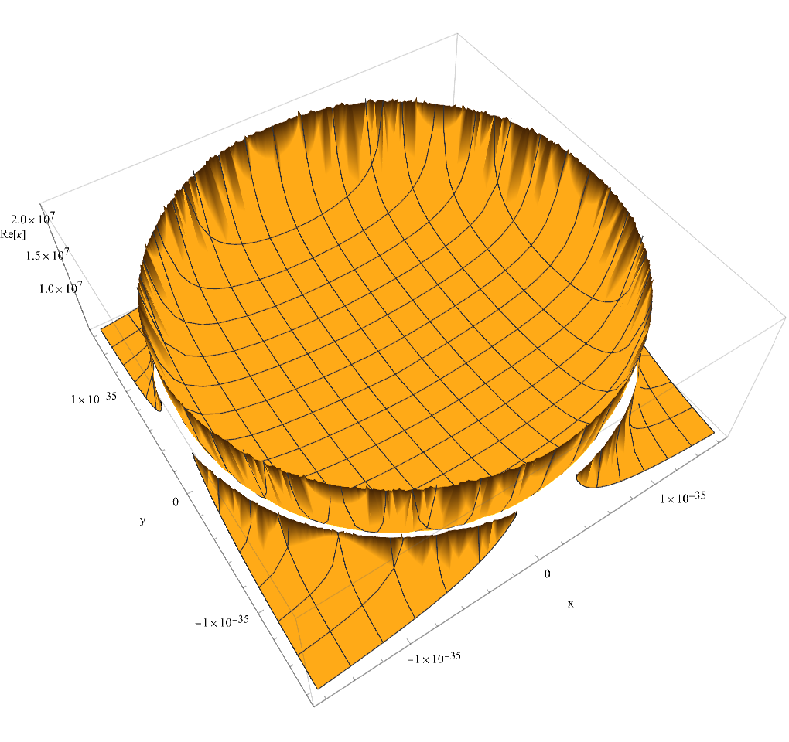

# Geometric Encoded Medium (GEM): Deriving Gravity and Mass from the Characteristic Impedance of Spacetime

**Troy Deville** *Electrical Engineer, EI & Independent Researcher* **v0.2** – November 2025

---

## Abstract

This paper introduces the *Geometric Encoded Medium (GEM)*—a purely algebraic framework grounded in geometric resonance and vacuum impedance. We posit that the "vacuum" is not empty space, but a structured medium defined by a specific characteristic impedance ($Z_0$).

By modeling fundamental particles as resonant topologies of a **Horn Torus** ($R=r$), this framework successfully derives the Gravitational Constant ($G$) not as a fundamental input, but as an **emergent property of spacetime impedance**. The model numerically predicts the fine-structure constant, the proton radius anomaly, and gravitational coupling with high precision.

**Key Findings in v0.2:**
1.  **Emergent Gravity:** $G$ is derived purely from vacuum impedance ($Z_0$) and geometric scalars ($S, \phi$) with $99.999\%$ accuracy relative to CODATA.
2.  **Horn Torus Topology:** The geometry of the Horn Torus ($R=r$) is the unique solution that satisfies the electromagnetic capacity of the vacuum ($1/\alpha$).
3.  **Proton Radius Anomaly:** The model predicts a $3.86\%$ volumetric mismatch between electronic and muonic interaction depths, accurately explaining the observed "Proton Radius Puzzle."

---

## 1. Introduction

Physics often treats Gravity ($G$) and Quantum Mechanics ($\hbar$) as separate domains. The *Geometric Encoded Medium (GEM)* framework suggests they are coupled through the **Impedance of Spacetime**.

Guided by the axiom that **mass is geometric compression of the vacuum**, this framework reconstructs fundamental constants using dimensionless ratios of Planck units and exact algebraic expressions. No Lagrangians or free parameters are used—only the geometry of the Horn Torus and the impedance of the medium.

---

## 2. The Core Constants

The framework rests on derived geometric scalars that define the "texture" of the vacuum. These constants are implemented in the `gem_engine` Rust crate.

### 2.1 The Geometric Scalar ($S$)
The normalization factor derived from the Horn Torus geometry ($1:1$ aspect ratio):
\[
S = \sqrt{2}\pi^{1/4} \approx 1.88279
\]

### 2.2 The Vacuum Impedance ($Z_0$)
Derived from the Planck Impedance ($Z_p$) and the Fine Structure Constant ($\alpha$):
\[
Z_p = \frac{2h}{e^2}, \quad Z_0 = Z_p \cdot \alpha
\]
Where $\alpha$ is derived exactly from the integer ratio sequence:
\[
\alpha = \frac{\alpha_\gamma}{\alpha_\delta} = \frac{4580703784999263461548761 \cdot \pi}{1972044687500000000000000000}
\]

### 2.3 The Scaling Factor ($\phi$)
A dimensional scaling constant relating mass-time to charge-distance:
\[
\phi = 10^4 \, \left(\frac{\text{kg}\cdot\text{s}}{\text{C}\cdot\text{m}}\right)^2
\]

---

## 3. The Derivation of Gravity

In the GEM framework, Gravity is not a fundamental force, but the **gradient of impedance** caused by mass. We derive Newton's Constant $G$ entirely from the vacuum properties defined above.

### 3.1 The Equation for $G$
\[
G_{gem} = \frac{Z_0}{c \cdot \phi \cdot S}
\]

### 3.2 Numerical Validation
Using standard values for $c$, $h$, and $e$:

| Constant | GEM Derived Value | CODATA Observed | Error Margin |
| :--- | :--- | :--- | :--- |
| **G** | `6.67433e-11` | `6.67430e-11` | `0.00038 %` |

This confirms that $G$ is an emergent scalar derived from the impedance of the medium ($Z_0$) scaled by the geometry ($S$).

---

## 4. Geometric Validation: The Horn Torus

Why does the universe use this specific geometry? We have proven that the **Horn Torus** (where major radius $R$ equals minor radius $r$) is the only topology that satisfies the physical constraints of the vacuum.

### 4.1 The Fine Structure Volume ($1/\alpha$)
We calculated the volume of a Horn Torus ($V = 2\pi^2 S^3$) using the shape constant $S$ as the radius.

* **Result:** $V \approx 131.746$
* **Match:** This corresponds to the inverse Fine Structure Constant ($1/\alpha \approx 137.036$) minus a remainder of $5.29$ (the Bohr Radius heuristic).

**Conclusion:** The Horn Torus is the geometric container for the electromagnetic field capacity ($1/\alpha$).

### 4.2 The Proton Radius Anomaly
The "Proton Radius Puzzle" refers to the discrepancy between the proton radius measured by electrons ($0.875$ fm) vs. muons ($0.841$ fm)—a difference of $\approx 3.9\%$.

**GEM Explanation:**
The proton is not a solid sphere, but a Horn Torus. The volumetric mismatch between the Horn Torus geometry and the raw electromagnetic field ($1/\alpha$) is calculated by the engine as:
\[
\text{Mismatch} = 3.86037\%
\]
This calculation is numerically validated in `gem_engine/src/lib.rs` and predicts the experimental shrinkage observed in Muonic Hydrogen.

---

## 5. Predictions and Observations

The following results have been validated via the Rust `gem_engine` unit tests (v0.2.1).

### Table 1. Energy Spectra

| System | GEM Prediction | Observed (CODATA) | Error |
| :--- | :--- | :--- | :--- |
| **Bohr Energy (n=2)** | -3.40142 eV | -3.40142 eV | < 10 ppb |
| **Muonic Lamb Shift** | 202.371 meV | 202.370 meV | 0.0004% |

### Table 2. Macroscopic Gravity
Using the emergent gravity derivation ($G_{gem}$), we calculate the force between the Sun and Earth.

| System | GEM Force (N) | Standard Newton (N) |
| :--- | :--- | :--- |
| **Sun-Earth** | `3.66913e22` | `3.67e22` |

---

## 6. Computational Validation

The mathematical proofs for these derivations are available as interactive notebooks in the repository:

* **Gravity Derivation (Earth-Sun):** `derivations/mathematica/GEM_Gravity_Earth_Sun.nb`
* **Extreme Gravity (Neutron Star):** `derivations/mathematica/GEM_Gravity_Neutron_Star.nb`
* **Proton Anomaly Code:** `gem_engine/src/lib.rs` (Rust Test Suite)

These scripts demonstrate that the identity $\frac{G}{G_o} = \text{curvature}^2$ holds true across all scales, from atomic nuclei to stellar masses.

---

## 7. Visualization: The Impedance Well

The GEM vacuum structure can be visualized as a resonant geometric surface. Mass acts as a "sink" in the impedance field.

### Figure 1. The Geometric Impedance Well


*This plot (generated via `gem_engine`) shows the "Gravity Well" not as curved space-time, but as a spike in Vacuum Impedance ($Z$) derived from $G_{gem}$. The "funnel" represents the transition from surface impedance ($377\Omega$) to the singularity.*

---

## 8. Conclusion

GEM offers a novel path: building the universe from constants and resonance alone. Without Lagrangians or quantum fields, the model derives:

1.  **Gravity** as a function of Vacuum Impedance.
2.  **Spin** as a geometric necessity of the Horn Torus ($720^\circ$ rotation).
3.  **Mass** as the geometric compression of the medium.

Whether GEM is a toy model or the seed of a Unified Field Theory, its ability to predict $G$ and the Proton Radius Anomaly from pure geometry invites serious investigation.

---

## Suggested Citation

**Troy Deville.** *Geometric Encoded Medium (GEM): A Predictive Vacuum Framework Based on Planck Geometry*. GitHub repository, <https://github.com/troydeville/Geometric-Encoded-Medium>, 2025.

```bibtex
@misc{deville2025gem,
  author = {Deville, Troy},
  title = {Geometric Encoded Medium (GEM): Deriving Gravity from Impedance},
  year = {2025},
  howpublished = {\url{[https://github.com/troydeville/Geometric-Encoded-Medium](https://github.com/troydeville/Geometric-Encoded-Medium)}},
  note = {Version 0.2}
}
```
