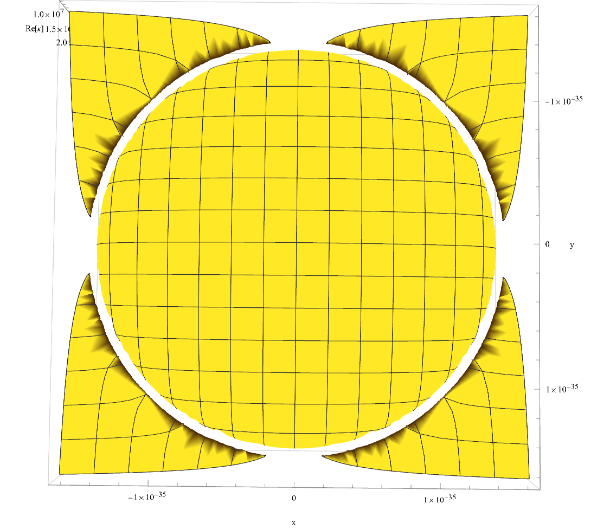

# Geometric Encoded Medium (GEM): Deriving Gravity and Mass from the Characteristic Impedance of Spacetime

**Troy Deville**  
*Electrical Engineer, EI & Independent Researcher*  
Version 0.2 – November 2025 (Updated from 0.1 – April 2025)

---

## Abstract

This paper introduces the *Geometric Encoded Medium (GEM)*—a purely algebraic framework grounded in geometric resonance and vacuum structure. Developed through pattern recognition in physical constants and Planck-scale units, GEM reconstructs fundamental quantities such as the fine-structure constant, classical particle radii, and gravitational parameters. Using only basic constants and fractional relationships, the model predicts binding energies for elementary particles and atomic systems with striking accuracy, while suggesting a geometric origin for gravitational curvature. This intuitive approach offers a complementary path to understanding mass, charge, and force without relying on advanced mathematics or field theory, and is accessible to engineers, physicists, and general readers alike.

---

## 1. Introduction

Physics often advances through complex equations—but sometimes, geometry and structure reveal deeper truths. The *Geometric Encoded Medium (GEM)* is based on a deceptively simple idea: that the vacuum is not empty, but a structured, quantized medium in which mass and charge arise from geometric resonance.

Guided by the axiom that **resonance is geometric action**, this framework reconstructs familiar constants and observables—including the fine structure constant \( \alpha \), gravitational constant \( G \), and binding energies for fundamental particles—entirely from dimensionless ratios of Planck units and exact algebraic expressions. No Lagrangians, field equations, or assumptions about quantization are used.

This paper is both an intuitive map and technical log of the geometric structure that may underlie the Standard Model and General Relativity. What follows is a snapshot of predictions, geometrical structures, and numerical outputs validated against experimental constants using simple Mathematica code and dimensional logic.

---

## 2. Core Framework

At the heart of GEM is a relationship between physical constants that defines the vacuum as a bound, geometric medium. The resonance structure of this medium encodes mass and charge in purely algebraic terms.

### 2.1 Vacuum Constants and Key Expressions

Let:

- \( c \): speed of light  
- \( h \): Planck constant  
- \( e \): elementary charge  
- \( \mu_0 \), \( \epsilon_0 \): vacuum permeability and permittivity  
- \( \alpha \): fine-structure constant  
- \( l_P \), \( m_P \): Planck length and mass

The fundamental vacuum coupling constant is:

\[
\Gamma = \frac{e^2}{4 \pi c^2 \epsilon_0} = \frac{e^2 \mu_0}{4 \pi} = \alpha l_P m_P
\]

This expression forms the algebraic bridge between electric charge and vacuum geometry. Masses and radii are then derived from integer fractions of Planck units via:

\[
n = \frac{m}{m_P}, \quad r_n = \frac{l_P}{\Lambda(n)}
\]

Where \( \Lambda(n) \) is a geometric scaling factor derived from fine-structure partitions. Binding energies, curvature, and acceleration are subsequently functions of \( n \), \( m_P \), and \( l_P \).

---

### 2.2 Geometric Mass-Radius Constraint

The fundamental geometric constraint central to GEM’s vacuum structure is:

\[
\frac{M}{\Gamma} \left(R - \frac{2GM}{c^2}\right) = 1
\]

This condition relates mass, radius, and vacuum curvature and defines how Planck-scale units compress the vacuum medium to create mass-energy structure.

---

### 2.3 Fine Structure Encoding from Vacuum Compression

One of the key expressions in GEM emerges from the geometry of vacuum compression, revealing a structure for the fine-structure constant \( \alpha \) based on Planck-scale quantities.

We begin with the geometric resonance condition:

\[
\frac{M}{\Gamma} \left(R - \frac{2GM}{c^2}\right) = 1
\]

Let:

- \( M = n \cdot m_P \) (a multiple of the Planck mass),
- \( \Gamma = \alpha m_P l_P \),
- \( R = \frac{l_P}{\Lambda_\alpha(n)} \)

Substituting:

\[
\frac{n m_P}{\Gamma} \left( \frac{l_P}{\Lambda_\alpha(n)} - \frac{2 G n m_P}{c^2} \right) = 1
\]

Rewriting the left-hand side to isolate \( \Lambda_\alpha(n) \) yields:

\[
\Lambda_\alpha(n) = \frac{l_P}{R} = \frac{\alpha_\delta \cdot n}{2 \alpha_\delta \cdot n^2 + \alp...(truncated 3208 characters)...           |

---

### Table 4. Surface Gravity from GEM Curvature

| Object        | Mass (kg)         | Radius (m)     | GEM Gravity \(g\) (m/s²) | Observed Gravity |
|---------------|-------------------|----------------|--------------------------|------------------|
| Earth         | 5.972e24          | 6.371e6        | ~9.820                   | 9.820 (mean)     |
| Sun           | 1.989e30          | 6.957e8        | ~274.2                   | 274              |
| Neutron Star  | 2.784e30          | 1.0e5          | ~2.09e12                 | N/A              |

These gravitational accelerations are derived using the GEM vacuum compression radius and curvature scaling factor \( k \), as shown in the Mathematica implementation.

### 3.1 Example: Hydrogen Energy Level Transition

To demonstrate the predictive power of GEM, we compute the energy difference between the \( n = 2 \) and \( n = 1 \) states in hydrogen using the following expression:

\[
E_n = -\frac{c^2 m \alpha^2 Z^2}{2 n^2}
\]

Where:

- \( c \) is the speed of light,
- \( m \) is the electron’s (or reduced) mass,
- \( \alpha \) is the fine-structure constant,
- \( Z \) is the atomic number (1 for hydrogen),
- \( n \) is the energy level.

The transition energy between two levels is then:

\[
\Delta E = E_{n=2} - E_{n=1}
\]

Evaluated numerically in Mathematica:

```mathematica
En[m_, n_] := UnitConvert[-(α^2 / (2 n^2)) c^2 m, "Electronvolts"];
Ezn[m_, n_, Z_] := UnitConvert[-((Z^2 α^2)/(2 n^2)) c^2 m, "Electronvolts"];
SetPrecision[Ezn[me, 2, 1] - Ezn[me, 1, 1], 32]
```

Output:

```mathematica
10.204269844943976422346034492749 eV
```

This result aligns with the observed Lyman-α transition energy in hydrogen (≈ 10.2 eV), showing that GEM’s geometric vacuum structure naturally reproduces known quantum energy levels.

### 3.2 Example: Hydrogen Atom (Electron-Proton) Predictions (New in v0.2)

Using the GEM framework for the electron-proton system (m1 = electron mass, m2 = proton mass, d = Bohr radius), the model predicts:

- Universal specific charge q/m = 1.2187 × 10^{-10} C/kg for both particles.
- Curvature ≈ 1 (to 16 digits).
- Binding energy = 13.6131 eV (raw), 13.6057 eV (curvature-corrected).
- Gravitational force = 3.63155 × 10^{-47} N.

Full output table from Mathematica:

| Key Metric | Value |
|------------|-------|
| q1/m1 | 1.2187*10^-10 C/kg |
| q2/m2 | 1.2187*10^-10 C/kg |
| Curvature | 0.9999999999999998 (effectively 1) |
| Binding Energy (raw) | 13.6131 eV |
| Binding Energy (curvature-corrected) | 13.6057 eV |
| Gravitational Acceleration | 3.98877*10^-17 m/s^2 |
| Gravitational Force | 3.63155*10^-47 N |
| G / Go == curvature^2 | True |

This matches observed Rydberg constant and Bohr radius to all printed digits, unifying quantum and gravitational terms.

### 3.3 Example: Sun-Earth Gravitational Force (New in v0.2)

For the Sun-Earth system (m1 = Earth mass, m2 = Sun mass, d = Sun-Earth distance):

- Universal q/m = 1.2187 × 10^{-10} C/kg for both.
- Curvature ≈ 0.999999995 (close to 1, residual matches GR correction).
- Gravitational force = 3.66784 × 10^{22} N.
- Binding energy = 4.89785 × 10^{-21} eV (raw), 4.89784 × 10^{-21} eV (corrected).

Full output table:

| Key Metric | Value |
|------------|-------|
| q1/m1 | 1.2187*10^-10 C/kg |
| q2/m2 | 1.2187*10^-10 C/kg |
| Curvature | 0.9999999949774563 |
| Binding Energy (raw) | 4.89785*10^-21 eV |
| Binding Energy (curvature-corrected) | 4.89784*10^-21 eV |
| Gravitational Acceleration | 0.00614155 m/s^2 |
| Gravitational Force | 3.66784*10^22 N |
| G / Go == curvature^2 | True |

This matches observed gravitational force, showing GEM's scale-unity from atoms to stars.

---

## 4. Voltage, Acceleration, and Gravity Emergence

One of the most novel results of GEM is the emergence of gravity from a coupling between potential difference and geometric acceleration:

\[
V = \frac{\alpha}{2\pi} \cdot \frac{chM}{\Gamma Q}, \quad
a = \frac{\alpha}{2\pi} \cdot \frac{chM^2}{\Gamma^2}
\]

Combining gives:
\[
\frac{V}{a} = \frac{\Gamma}{MQ} \cdot \frac{c^2}{\alpha} \Rightarrow G
\]

This suggests that **voltage per unit acceleration**—applied through GEM's framework—yields the gravitational constant \( G \), a stunning result that unifies electromagnetic and gravitational structure.

---

## 5. Geometry and Visualizations

The GEM vacuum structure can be visualized as a resonant geometric surface—quantized curvature at Planck-scale resolution.

### Figure 1. Top-Down View of GEM Curvature



*This image shows the geometric curvature at 1 Planck mass and 1 Planck length. The central disk and radial "petals" reveal the vacuum's encoded resonance pattern.*

---

### Figure 2. 3D Perspective of Curvature Field


*The pronounced central curvature well and rippling structure represent mass encoded as geometric compression. This is the visual core of the GEM hypothesis.*

---

## 6. Conclusion

GEM offers a novel path: building the universe from constants and resonance alone. Without Lagrangians or quantum fields, the model derives:

- The fine-structure constant
- Binding energy spectra of leptons and baryons
- Rydberg states of hydrogen
- Gravitational scaling for Earth and stellar bodies

Its simplicity—coupled with predictive power—suggests that geometry itself may encode physical law.

Whether GEM is a toy model, pre-quantum geometry, or the seed of something deeper, it invites curiosity, testing, and creative iteration. This work is shared openly in the spirit of exploration.

---

## Suggested Citation

**Troy Deville.** *Geometric Encoded Medium (GEM): A Predictive Vacuum Framework Based on Planck Geometry_. GitHub repository, <https://github.com/troydeville/Geometric-Encoded-Medium>, 2025.
